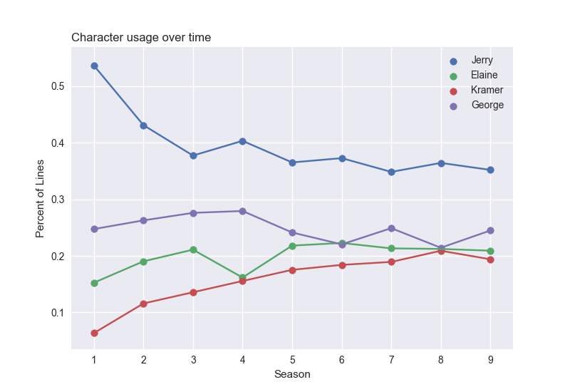
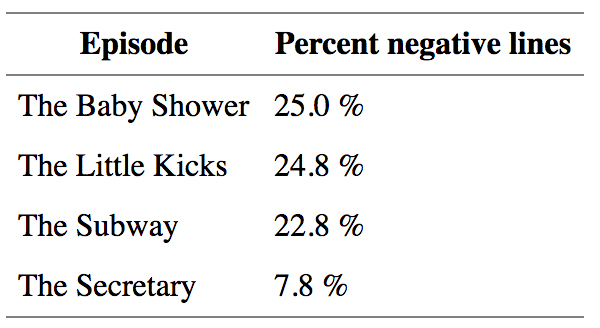
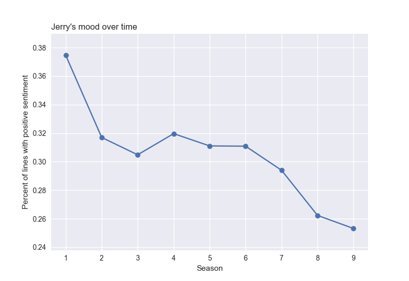
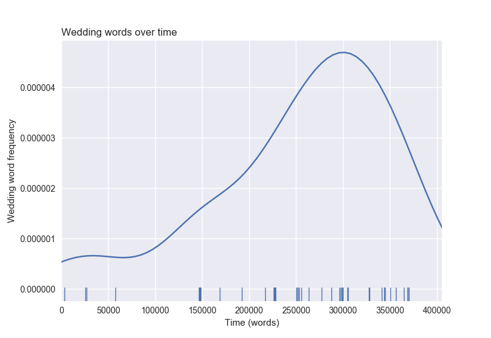

# seinfeld-analysis
An analysis about nothing.

## The Data

`scraper/scraper.py` contains the script to scrape every Seinfeld episode script from [Seinology](http://www.seinology.com/).  Here, we ananlyze the lines of the four main characters: Jerry, George, Elaine, and Kramer.

## Analysis

How do the characters's usage change over time?  Over nine seasons of Seinfeld, Elaine's and George's usage stayed fairly constant and Jerry's usage peaked in seasons 1 and 2. Interestingly, Kramer's usage steadily increased over the entire series, probably since they realized he was a fan-favorite.

Seinfeld is known for having a dark outlook on life.  But what is the most negative episode of all time?  **The Baby Shower**.  This is an episode where everything goes wrong: Jerry's TV has bad reception, George wants to confront the performance artist who poured bosco on his shirt, Elaine's baby shower get's crashed by Russians.

Interestingly, both The Baby Shower and The Subway were written by Larry Charles, my least favorite Seinfeld writer.  I wrote a very long piece on him as a writer many years ago, and in that peice I failed to notice his negativity.

Trivia: the least negative Seinfeld episode, The Secretary, has a guest appearance by Uma Thurman.

How do the characters's mood change over time? The most interesting trend I found was what happened after Larry David left the project (in seasons 8 and 9).  With Larry David gone, Jerry became a much less positive character.  While he was the dominant positive character in previous seasons, his positivity dropped once Larry David left.

One gripe I have with Seinfeld is about halfway through the series there is a lot of wedding/marriage talk.  Below, I'm plotting the occurances of wedding related words (marriage, wedding, etc) over time.  As expected, they start ramping up halway through the series.

